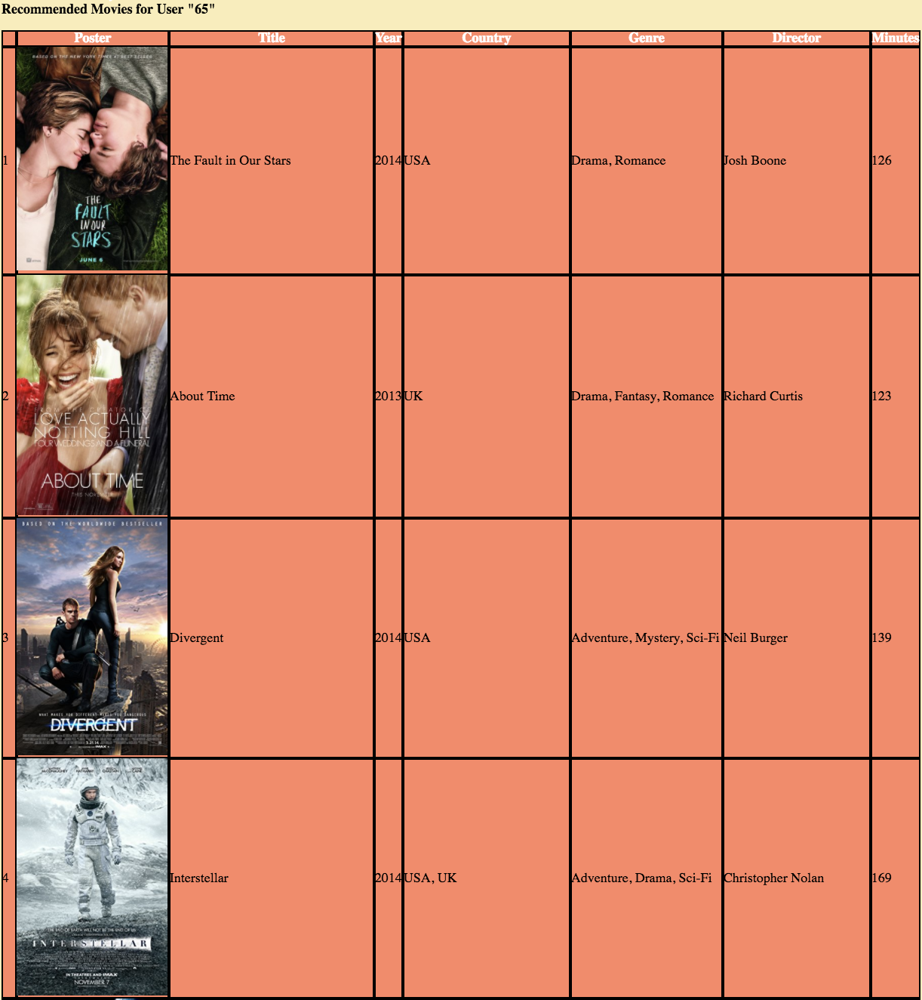

# Movie Recommender System, April-May 2018 
Java implementation of a movie recommender system as a Capstone Project from Duke University's 5-course specialization "Java Programming and Software Engineering Fundamentals Specialization" (citation below).  

Given a user for whom recommendations are to be created, adds dot-products of the standardized ratings for movies rated by both said user and other movie-reviewers to determine the weightage each reviewer's reviews will have on the user. 
Multiplies the dot-product with the each reviewer's movie-review to create a weighted-rating and for a particular movie, takes the average weighted ratings for a set amount of reviewers. Sorting these movies in descending order of weighted average results in the list of movie recommendations for the user.
The first movie in the list is the one with the highest recommendation for the user.

The [src folder](src) has the java implementation of the project. (I have grouped certain files together into folders for the sake of making it easier to navigate through this repo. However, if you want to download and compile the project yourself, you will have to empty both the "src" and "ctx" folders' contents back into the main "MovieRecommenderSystem-master" folder. Then open "package.bluej.").

(A screenshot of what the outputted HTML table of recommendations looks like. In BlueJ, right-click on the "RecImplementation" class and then on "new RecImplementation()." Then right-click on the red box that appears and on "void printRecommendationsFor(String webRaterID)" and in the popup type the String "65". This will output the HTML for this table. The picture above is how the table looks styled with CSS which I have done on my website that I am currently working on.)

Citation: 
“Java Programming and Software Engineering Fundamentals.” Coursera, Michigan State University, www.coursera.org/specializations/java-programming#about.
